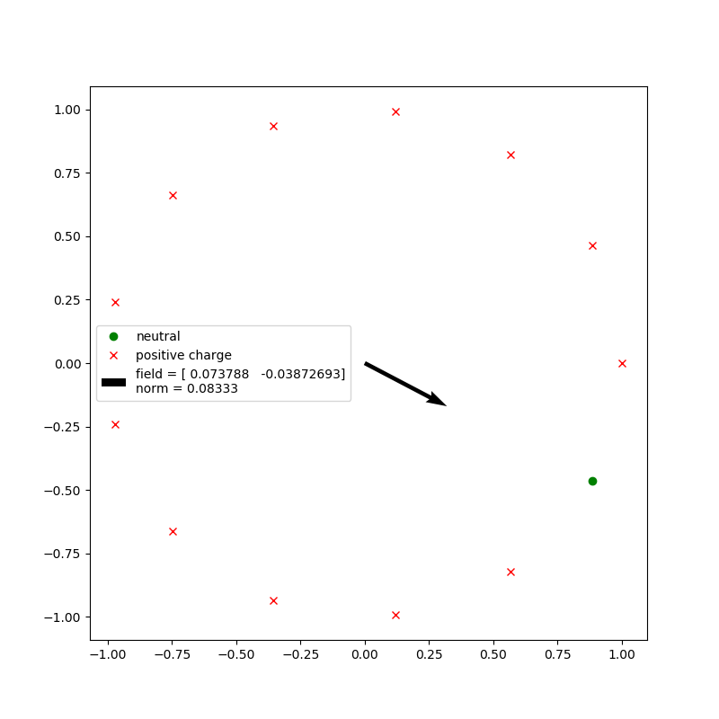
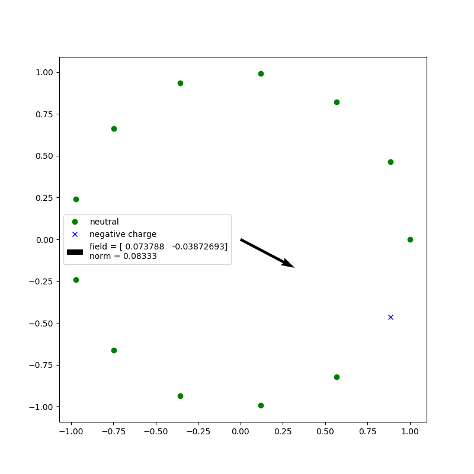
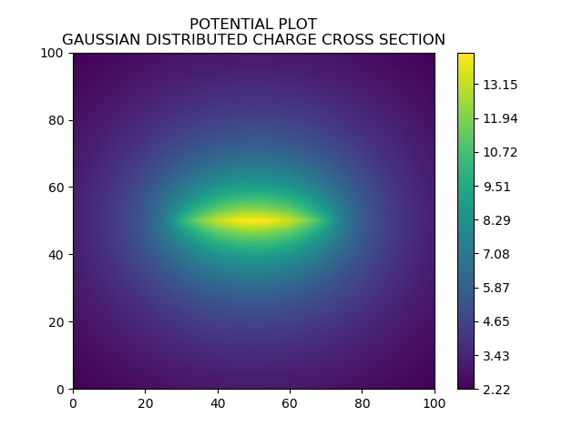
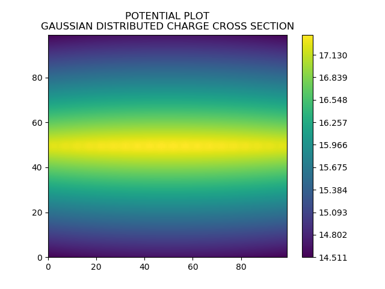

# my code for electricity and magnetism

In this repository I put my e and m related code

## these pictures are from assignment 1
GIF of charges

twelve positive charges around a circle with 13 slots

one negative charge in the missing slot, gives the same field, we deduce this from principle of superposition

## these pictures are from assignment 2
The electric field multiplied, modified slightly to make it look nicer

The electric field as it actually is

The electirc potential, cross section in yz plane, the chared square lies in x,y plane, as for the two above pictures

The electric potential near the plate

The electric field near the plate

